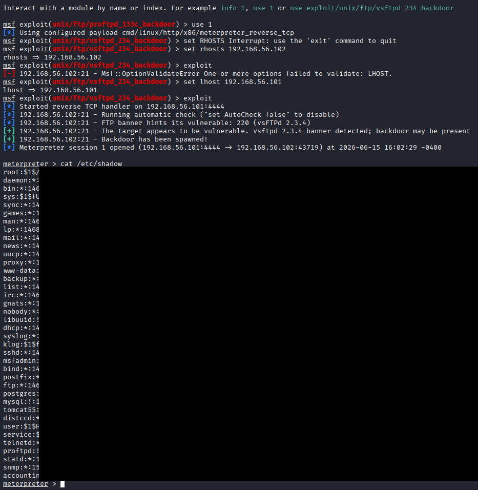

# Metasploit: vsftpd 2.3.4 Backdoor (Lab VM)

**Domain:** Cybersecurity | **Tools:** Kali Linux, Metasploit Framework, Meterpreter

> Performed only against an intentionally vulnerable virtual machine on a private lab network (`192.168.56.0/24`), for educational purposes.

## Overview

Metasploit's `unix/ftp/vsftpd_234_backdoor` module was run against the lab VM, whose FTP banner identified it as vsFTPd 2.3.4. The exploit spawned a backdoor and opened a Meterpreter session; the post-exploitation step read the VM's account file to demonstrate the impact.

## Security takeaway

vsFTPd 2.3.4 shipped with a malicious backdoor. Mitigations: patch or replace the vulnerable service, restrict FTP exposure with firewall rules, and monitor for unexpected outbound connections and shells.

## Privacy

Password hash entries from the target's account file are blacked out in the screenshot.

## Skills demonstrated

- Identifying a vulnerable service from its banner
- Configuring a Metasploit module (`RHOSTS`, `LHOST`) and troubleshooting a validation error
- Documenting a vulnerability with its remediation
