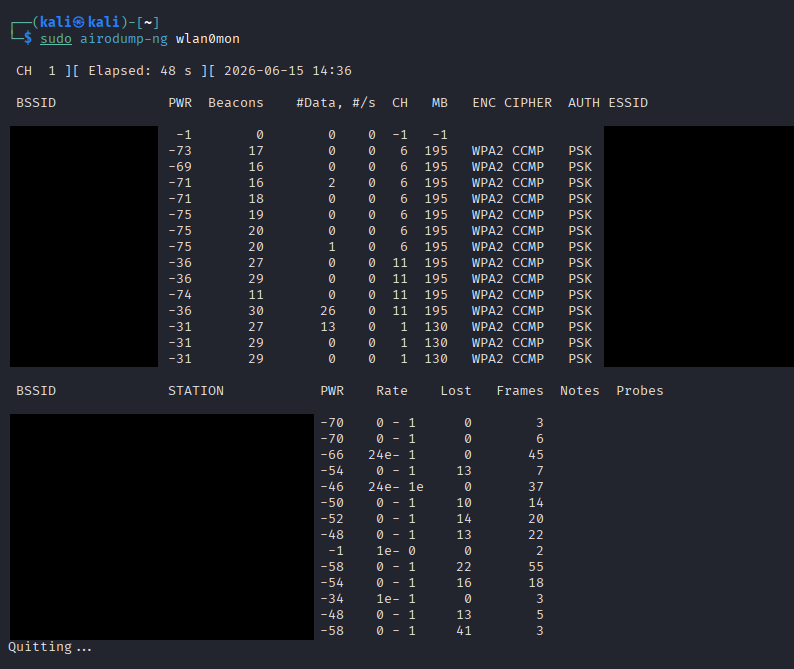

# Wireless Reconnaissance with airodump-ng

**Domain:** Cybersecurity | **Tools:** Kali Linux, aircrack-ng suite (`airodump-ng`)

## Overview

Passive wireless survey from Kali Linux: `sudo airodump-ng wlan0mon` run on a monitor-mode interface for 48 seconds (2026-06-15).

## What the output shows

- Nearby access points on channels 1, 6 and 11, all WPA2 / CCMP / PSK
- Per-AP signal strength, beacon and data counts
- A second table of client stations seen on those access points

## Privacy

Network names (ESSIDs), BSSIDs and client MAC addresses belong to third-party networks and devices, so they are redacted from the screenshot.

## Why parts are redacted

This screenshot documents the survey technique, but the original capture included identifiers for nearby real-world devices and networks. Those values are hidden so the page demonstrates the lab skill without disclosing other people's network details.

## Skills demonstrated

- Running a passive wireless capture on a monitor-mode interface
- Reading airodump-ng access point and station tables
