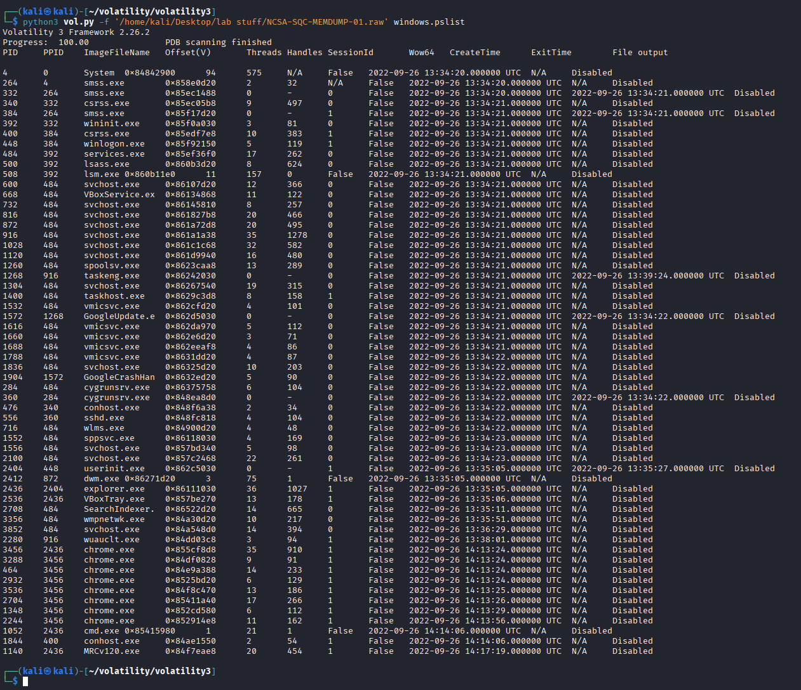
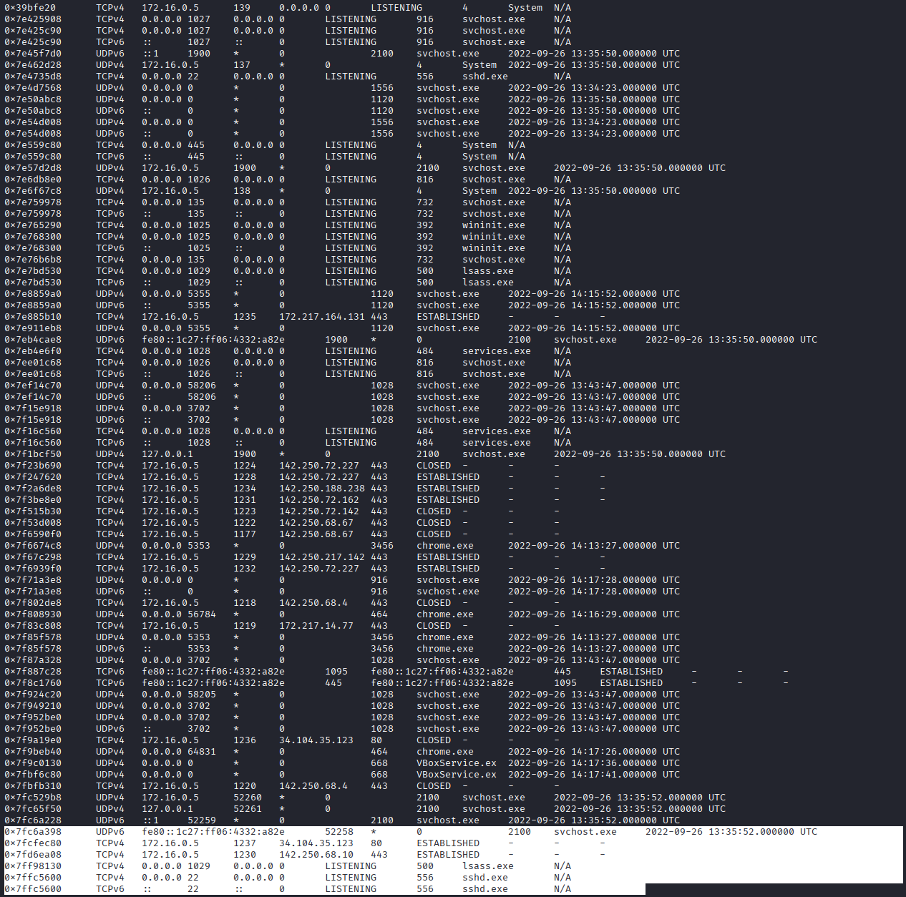
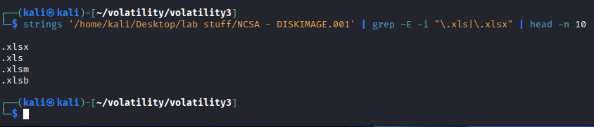

# NCSA Memory & Disk Forensics Lab

**Domain:** Cybersecurity / Incident Response | **Tools:** Kali Linux, Volatility 3, `strings`, `grep`

## Overview

Evidence-analysis exercise from NGT Academy using two artifacts: a Windows memory capture (`NCSA-SQC-MEMDUMP-01.raw`) and a disk image (`NCSA - DISKIMAGE.001`). The screenshots below show the commands run on Kali Linux and their output.

## Memory analysis (Volatility 3)

Process listing with `windows.pslist`, showing parent/child relationships and creation times (the memory capture's timestamps are from 2022-09-26):

Network connections recovered from the memory image, showing listening services and established connections with owning processes:

## Disk image analysis

Keyword search of the raw disk image with `strings` and `grep`:

Search for spreadsheet file extensions (`.xls`, `.xlsx`) in the image:

## Skills demonstrated

- Running Volatility 3 plugins against a memory image
- Reviewing process trees and network connections
- Searching a disk image for strings and file-type artifacts with command-line tools

## Notes

Only what is visible in the screenshots is described here; findings and conclusions from the original lab guide are not included.