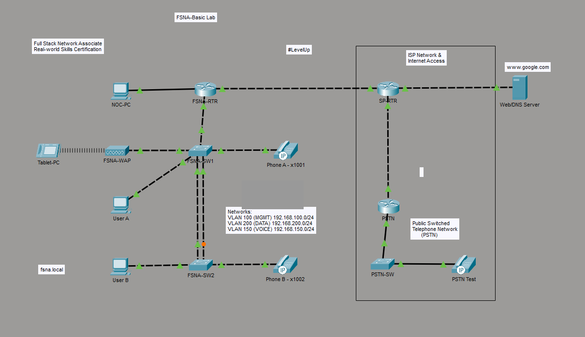

# Packet Tracer Lab: FSNA-Basic (Full Stack Network Associate)

**Domain:** Networking | **Tool:** Cisco Packet Tracer | **Format:** `.pka` activity file

## Overview

A hands-on Cisco Packet Tracer activity from the **Full Stack Network Associate (FSNA) Real-world Skills Certification** at NGT Academy. The topology models a small office network with voice, wireless and simulated ISP and PSTN connectivity.

## Network Design

| Area | Components |
|------|------------|
| Site network | Router `FSNA-RTR`, switches `FSNA-SW1` / `FSNA-SW2` (redundant links between them), wireless AP `FSNA-WAP` |
| Endpoints | `NOC-PC`, `User A`, `User B`, `Tablet-PC`, IP phones x1001 and x1002 |
| Segmentation | VLAN 100 (MGMT) `192.168.100.0/24`, VLAN 150 (VOICE) `192.168.150.0/24`, VLAN 200 (DATA) `192.168.200.0/24` |
| Internet / ISP | Service-provider router `SP-RTR`, web/DNS server (`www.google.com`) |
| Telephony | Simulated PSTN (router, switch, test phone) |
| Domain | `fsna.local` |

## Skills Demonstrated

Based on the topology above:

- Layer 2 switching with VLAN segmentation (management, data, voice)
- Multi-switch connectivity with inter-switch links
- Router-based connectivity to a simulated ISP and Internet
- Wireless access point integration
- IP telephony endpoints alongside data traffic

## Files

| File | Description |
|------|-------------|
| [`TYLER DAVIS FSNA SQC.pka`](<TYLER DAVIS FSNA SQC.pka>) | Packet Tracer activity file (original, unmodified) |
| [`topology.png`](topology.png) | Topology screenshot |

## Opening the Lab

GitHub cannot render `.pka` files, so download the file and open it locally:

1. Install [Cisco Packet Tracer](https://www.netacad.com/cisco-packet-tracer) (free through Cisco Networking Academy).
2. Download the `.pka` from this folder.
3. Open it with **File > Open**, or double-click it.

A recent Packet Tracer version is recommended. The version used to create the file is unknown.

## Notes

Task instructions and device configurations are stored inside the `.pka` and were not extracted for this page. Lab login credentials shown in the original screenshot have been redacted.